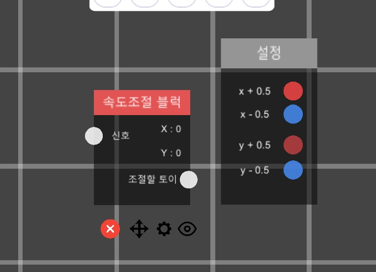
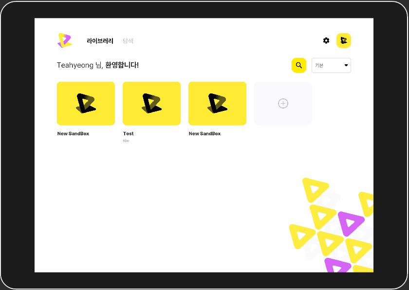
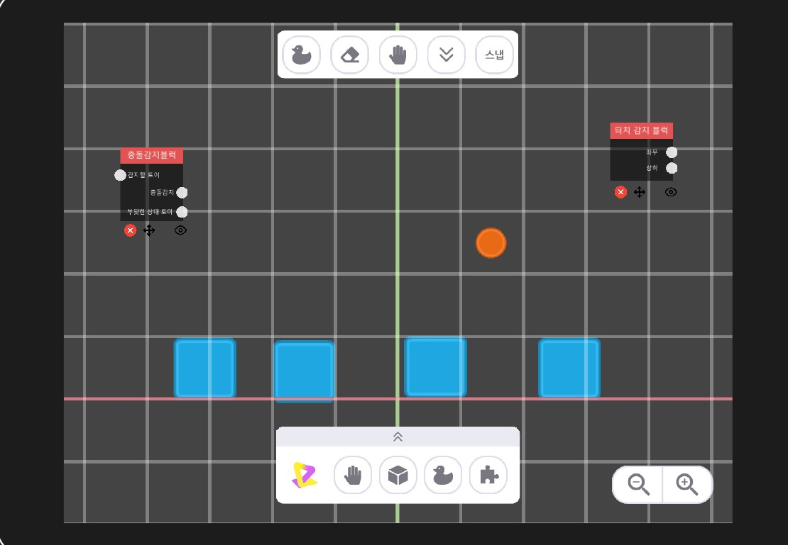
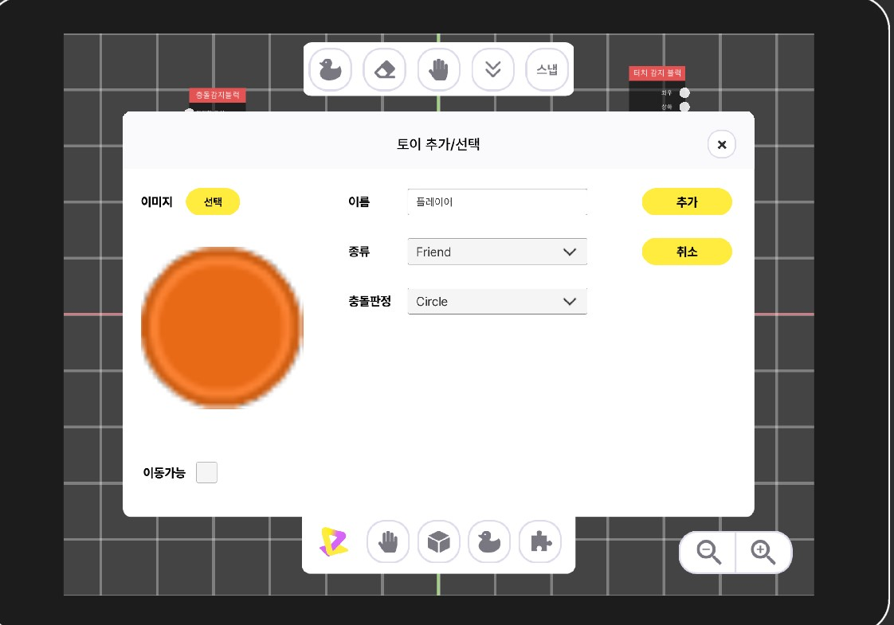
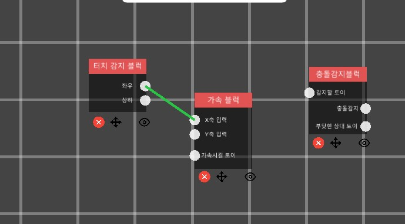
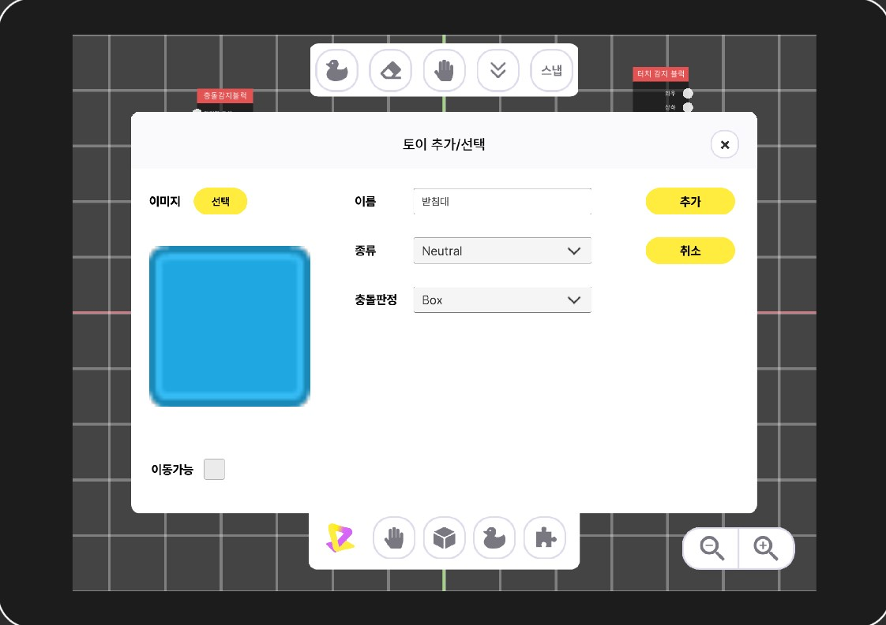
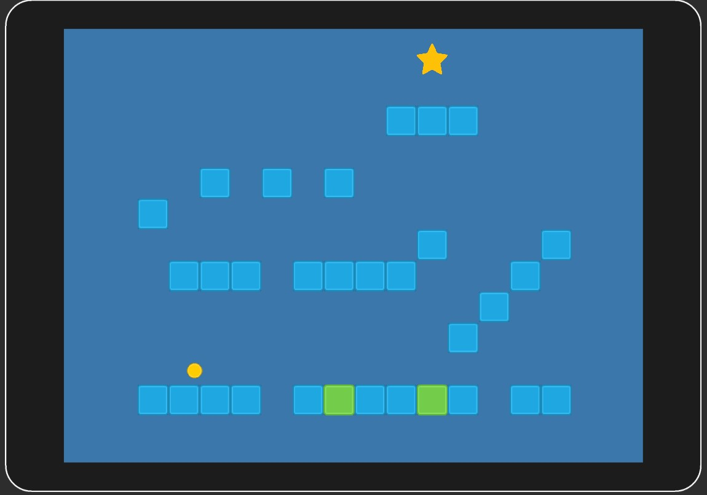

# PlayGround 소개

사용자들이 모바일 환경에서 간편하게 게임을 제작하고, 만든 게임을 공유할 수 있는 플랫폼을 제공하는 프로젝트 입니다.

프로그래밍 지식이 없어도 제공되는 **토이**(게임 오브젝트) 편집기와 **이벤트 블록** 에디터를 사용하여 간단하게 게임 을 만들 수 있습니다.

# 실행 환경

- WebGL 2.0 을 지원하는 웹 브라우저 (최신 웹 브라우저 대부분이 WebGL 2.0을 지원합니다.)
- 터치 입력을 받을 수 있는 디바이스

# 주요 기능

#### 비 전문가도 사용할 수 있는 블록형 코딩도구 제공

- 다양한 기능을 제공하는 블록들의 입력단자와 출력단자를 연결해 이벤트를 발생시키고 게임을 설계할 수 있습니다.

- 유저 입력을 감지하고 터치한 위치에 따라 출력값이 변하는 블록과 토이의 움직임을 제어하는 블록을 연결하여 게임 내 오브젝트를 움직일 수 있습니다.
- 토이의 충돌을 감지하는 블록을 이용해 물체간 충돌시 신호를 발생시킬 수 있습니다.
- 오디오 블럭을 사용해 배경음악이나 효과음을 실행시킬 수 있습니다.

#### 게임 제작에 필요한 기본적인 에셋 제공

- 게임 디자인에 필요한 기본적인 에셋을 지원하여 사용자들이 게임을 개발하는 경험에 더 집중할 수 있습니다.

- [구현 예정] 각종 기능들을 더 쉽게 이해할 수 있도록, 게임 시나리오별 튜토리얼을 지원합니다. 

#### 플레이 경험 공유

- 사용자가 만든 게임은 서버에 업로드하여 여러 사용자들이 서로 게임을 공유하고 플레이 할 수 있습니다.
- 다른 유저들이 여러 게임을 통해 영감을 얻을 수 있도록 합니다.
- 잘 만들어진 게임들을 추천할 수 있도록 게임 평가 시스템을 제공합니다.

# 기능별 상세

## 샌드박스 라이브러리

**새로운 샌드박스(게임)를 생성하거나 공유할 수 있는 플랫폼 **

- 새로운 게임을 만들 수 있습니다.

- 샌드박스를 선택하고 편집기로 진입하거나 플레이 할 수 있습니다.
- 탐색창에서 다른 사용자들이 업로드한 샌드박스들을 검색하고 다운받을 수 있습니다. 다운받은 샌드박스는 샌드박스 라이브러리에 추가됩니다.
- 평가 시스템을 사용하여 샌드박스 제작자에게 피드백을 제공할 수 있습니다.

## 샌드박스 편집기

#### 편집화면

**사용자가 토이나 블록을 배치하고 삭제할 수 있는 편집화면입니다**

- 우측 아래 버튼을 눌러 화면 줌인, 아웃을 할 수 있습니다.
- 화면을 드래그하여 시점을 움직일 수 있습니다.
- 스냅 기능을 이용해 토이를 격자에 맞춰 배치할 수 있습니다.
- 배치된 블록이나 토이의 위치를 자유롭게 이동시킬 수 있습니다.
- 블록을 서로 연결하는 동작을 수행할 수 있습니다.
- 하단 좌측 플레이 버튼을 눌러 게임을 실행시킬 수 있습니다.

#### 토이 편집기

**상호작용 가능한 다양한 토이(게임 오브젝트)를 만드는 도구입니다.**

- 다양한 크기의 토이를 제작할 수 있습니다.
- 충돌 타입(박스, 원형, 충돌없음)을 설정할 수 있습니다.
- 토이를 선택하여 화면의 원하는 위치에 배치할 수 있습니다.

- 속성에 따라 게임을 구성하는 지형이나 배경으로 활용 가능합니다.

#### 이벤트 블록

**게임을 구성하는 규칙을 설계할 수 있는 도구입니다. **

- 입력 단자와 출력 단자를 서로 연결하여, 사용자가 원하는 동작을 구성 가능합니다.

- 카메라블록을 이용하여 게임플레이어가 볼 시점을 정하고 범위를 조절할 수 있습니다.

- 터치 입력 블록을 이용해 플레이어가 누르는 화면의 위치를 감지하고 출력 단자로 값을 내보냅니다.
- 속도 조절 블록을 이용해 신호가 발생할 때 연결된 토이의 속도를 지정할 수 있습니다.
- 충돌 감지 블록을 이용해 특정 토이에 충돌이 발생하였을 때 출력단자로 신호와 상대 토이 정보를 내보냅니다.
- 가속 블록을 이용해 입력단자에 값을 받고 연결된 토이의 가속도를 조절할 수 있습니다.
- 토이 파괴블록을 이용해 신호가 들어오면 연결된 토이를 파괴시킬 수 있습니다.
- 오디오 재생 블록을 이용해 신호가 들어오면 설정한 효과음이나 음악을 재생할 수 있습니다.

#### 이미지 임포트 도구

- 토이 편집기에서 사용할 이미지를 업로드 할 수 있습니다.
- 원하는 이미지를 크기를 조절하여 사용할 수 있습니다.

#### 게임 실행

**샌드박스 편집기로 만든 게임을 실행할 수 있습니다.** 
